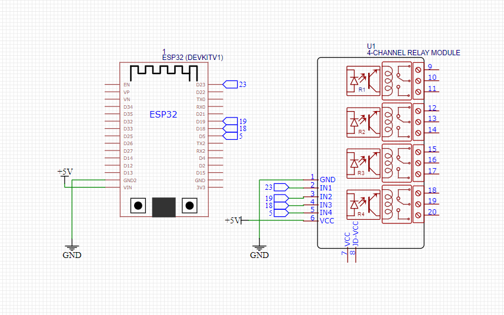

# Control Relay with ESP32 Web Server

---

---

## Dasar Teori

### Apa itu ...

### Cara Kerja

## Alat dan Bahan

## Langkah Kerja

## Wiring

## Code

## Hasil

## Kesimpulan

### Permasalahan

### Kekurangan

### Future Ideas

---

## Source