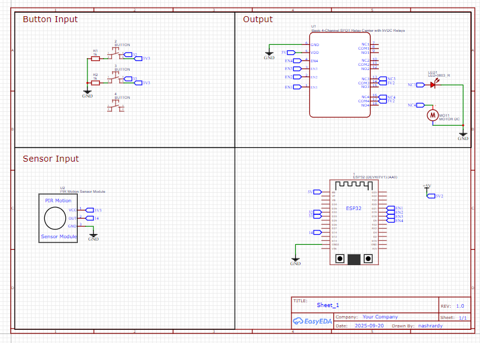

# Control Home with IoT

## Dasar Teori

### Apa itu Relay

### Apa itu EPS32

### Apa itu ESPAsyncWebserver

### Cara Kerja

Cara kerja dari alat ini adalah 

## Alat dan Bahan

- ESP32 DevKit
- h

## Langkah Kerja

1. Siapkan Alat dan Bahan
2. h

## Wiring

### Wiring Pertama

## Code

## Hasil

## Kesimpulan

### Permasalahan

### Kekurangan

### Future Ideas
