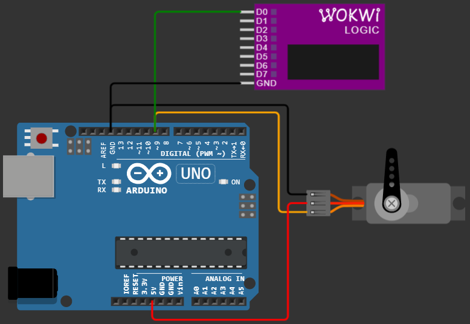

# Radar using Ultrasonic Sensor and Arduino with Processing Software

Radar (yang dalam bahasa Inggris merupakan singkatan dari radio detection and ranging, yang berarti deteksi dan penjarakan radio) adalah suatu sistem gelombang elektromagnetik yang berguna untuk mendeteksi, mengukur jarak dan membuat map benda-benda seperti pesawat terbang, berbagai kendaraan bermotor dan informasi cuaca (hujan).

Namun pada projek kali ini, kita akan menggunakan sensor Ultrasonic sebagai input dari alat kita. Dan kemudian kita akan menampilkan hasil tangkapan sensor tersebut di laptop dengan bantuan Processing Software

##  HC-SR04 Ultrasonic Sensor
Tentu, mari kita bahas dasar teori dari masing-masing komponen tersebut: sensor ultrasonik HC-SR04, servo, dan software Processing.

1. Sensor Ultrasonik HC-SR04
Sensor ultrasonik HC-SR04 adalah sebuah perangkat yang menggunakan gelombang suara ultrasonik untuk mengukur jarak ke suatu objek. Berikut adalah dasar teorinya:

Gelombang Ultrasonik: Sensor ini bekerja dengan memancarkan gelombang suara pada frekuensi ultrasonik (di atas batas pendengaran manusia, biasanya sekitar 40 kHz).

Prinsip Kerja:

- Transmitter: Sensor memiliki sebuah transmitter (pemancar) yang menghasilkan burst gelombang ultrasonik ketika dipicu oleh sinyal listrik singkat (biasanya pulsa HIGH selama 10 µs pada pin Trigger).
- Perambatan Gelombang: Gelombang ultrasonik ini kemudian merambat melalui udara dengan kecepatan suara. Kecepatan suara di udara pada suhu ruang (sekitar 20°C) adalah sekitar 343 meter per detik atau 34.3 cm per milidetik. Kecepatan ini sedikit bervariasi tergantung pada suhu dan kelembaban udara.
- Pantulan Gelombang: Ketika gelombang ultrasonik mengenai suatu objek, gelombang tersebut akan dipantulkan kembali ke arah sensor.
- Receiver: Sensor juga memiliki sebuah receiver (penerima) yang mendeteksi gelombang ultrasonik yang dipantulkan ini.
- Pengukuran Waktu: Sensor mengukur waktu antara pengiriman gelombang ultrasonik oleh transmitter dan penerimaan gelombang pantul oleh receiver. Waktu ini sering disebut sebagai time-of-flight (TOF).
- Perhitungan Jarak: Jarak ke objek dapat dihitung berdasarkan waktu tempuh gelombang ultrasonik. Karena gelombang suara menempuh jarak bolak-balik (dari sensor ke objek dan kembali ke sensor), waktu yang diukur adalah dua kali waktu yang dibutuhkan gelombang untuk mencapai objek. Oleh karena itu, rumus untuk menghitung jarak adalah:

		Jarak = Kecepatan Suara * Waktu Tempuh / 2

Jika waktu tempuh (Δt) diukur dalam detik dan kecepatan suara (v) adalah 343 m/s, maka jarak (d) dalam meter adalah:
 

Atau, jika waktu tempuh diukur dalam mikrodetik (μs) dan kecepatan suara dianggap 34.3 cm/ms atau 0.0343 cm/µs, maka jarak dalam sentimeter adalah:

	d = 0.034 * t /2  (dalam mikrodetik)
	

 

Pinout HC-SR04: Sensor HC-SR04 biasanya memiliki 4 pin:

VCC: Pin catu daya (biasanya +5V).
Trig (Trigger): Pin input yang digunakan untuk memicu pengiriman gelombang ultrasonik. Pulsa HIGH singkat (minimal 10 µs) harus diberikan ke pin ini.
Echo: Pin output yang memberikan pulsa HIGH dengan durasi yang sebanding dengan waktu tempuh gelombang ultrasonik.
GND (Ground): Pin ground atau 0V.

## Servo 
Servo adalah jenis motor yang memungkinkan kontrol yang tepat terhadap posisi sudut, kecepatan, dan percepatan. Berikut adalah dasar teorinya:

Konstruksi Dasar: Sebuah servo biasanya terdiri dari motor DC kecil, gearbox (serangkaian roda gigi), potensiometer (untuk umpan balik posisi), dan rangkaian kontrol elektronik.

### Prinsip Kerja:

1. Sinyal Kontrol: Servo dikontrol oleh sinyal PWM (Pulse Width Modulation). Sinyal PWM adalah sinyal gelombang persegi dengan lebar pulsa (duty cycle) yang bervariasi.
2. Pengkodean Posisi: Lebar pulsa sinyal PWM menentukan posisi sudut yang diinginkan oleh servo. Standar umum untuk servo adalah:
3. Pulsa sekitar 1 ms (atau kurang) biasanya menggerakkan servo ke satu ekstrem posisi (misalnya 0 derajat).
4. Pulsa sekitar 1.5 ms biasanya menggerakkan servo ke posisi tengah (misalnya 90 derajat).
5. Pulsa sekitar 2 ms (atau lebih) biasanya menggerakkan servo ke ekstrem posisi lainnya (misalnya 180 derajat). Periode sinyal PWM biasanya sekitar 20 ms (50 Hz).
6. Umpan Balik Posisi: Potensiometer yang terhubung secara mekanis dengan output shaft servo memberikan informasi tentang posisi aktual shaft.
7. Kontrol Loop Tertutup: Rangkaian kontrol di dalam servo membandingkan posisi yang diinginkan (berdasarkan lebar pulsa PWM) dengan posisi aktual (dari potensiometer). Jika ada perbedaan, motor akan diaktifkan untuk memutar shaft hingga posisi aktual sesuai dengan posisi yang diinginkan. Proses ini adalah contoh dari sistem kontrol loop tertutup.

### Jenis-jenis Servo:

- Servo Standar: Biasanya memiliki rentang gerak sekitar 0 hingga 180 derajat.
- Servo Kontinu (Continuous Rotation Servo): Berbeda dengan servo standar, servo ini dapat berputar secara terus menerus seperti motor DC biasa. Sinyal PWM mengontrol kecepatan dan arah putaran, bukan posisi sudut.
- Servo Digital: Menggunakan mikrokontroler di dalam unit servo untuk kontrol yang lebih presisi dan responsif dibandingkan servo analog.
- Pinout Servo: Servo biasanya memiliki 3 kabel:

Coklat atau Hitam: Ground (GND).
Merah: Catu daya (biasanya +5V atau +6V, tergantung spesifikasi servo).
Kuning, Oranye, atau Putih: Pin sinyal kontrol (PWM).

## Processing Software

Processing adalah sebuah bahasa pemrograman dan lingkungan pengembangan terintegrasi (IDE) open-source yang dibangun untuk seniman, desainer, pendidik, dan pemula. Berikut adalah dasar teorinya:

- Bahasa Pemrograman: Processing didasarkan pada bahasa Java, tetapi dengan sintaks yang disederhanakan dan mudah dipelajari, terutama bagi mereka yang tidak memiliki latar belakang pemrograman yang kuat.

- IDE (Integrated Development Environment): Processing IDE menyediakan editor kode, compiler, dan jendela output visual. Ini memudahkan pengguna untuk menulis kode, menjalankan program, dan melihat hasilnya secara grafis.

- Fokus pada Visualisasi: Processing sangat kuat dalam menghasilkan visualisasi interaktif, animasi, dan grafik. Pustaka-pustaka bawaannya menyediakan fungsi-fungsi untuk menggambar bentuk, warna, teks, gambar, video, dan berinteraksi dengan input seperti mouse dan keyboard.

- Ekosistem Pustaka: Processing memiliki banyak pustaka (libraries) yang dikembangkan oleh komunitas untuk memperluas kemampuannya. Pustaka ini memungkinkan Processing untuk berinteraksi dengan berbagai jenis perangkat keras (seperti Arduino, sensor, kamera), memproses data, melakukan komunikasi jaringan, dan banyak lagi.

- Sketch: Program di Processing disebut "sketch". Setiap sketch memiliki struktur dasar dengan dua fungsi utama:

	- setup(): Fungsi ini dijalankan sekali di awal program. Biasanya digunakan untuk inisialisasi, seperti mengatur ukuran jendela, mode rendering, dan inisialisasi variabel.
	- draw(): Fungsi ini dijalankan berulang kali setelah setup() selesai. Ini adalah tempat utama untuk menggambar dan memperbarui animasi. Frame rate (kecepatan draw() dijalankan) dapat diatur.
- Interaksi dengan Hardware (melalui Pustaka): Untuk berinteraksi dengan sensor HC-SR04 dan servo yang terhubung ke mikrokontroler (seperti Arduino), Processing biasanya menggunakan komunikasi serial. Mikrokontroler akan membaca data dari sensor dan mengontrol servo, lalu mengirimkan data atau menerima perintah dari komputer yang menjalankan Processing melalui koneksi USB (yang terdeteksi sebagai port serial). Pustaka seperti processing.serial memungkinkan Processing untuk membaca dan menulis data melalui port serial.

Secara keseluruhan, dalam konteks penggunaan bersama:

Sensor HC-SR04 akan mengukur jarak dan mengirimkan informasi ini ke mikrokontroler.
Mikrokontroler akan menerima data jarak dari HC-SR04 dan mengontrol posisi servo berdasarkan data tersebut atau perintah dari software Processing.
Software Processing akan berkomunikasi dengan mikrokontroler melalui serial, mungkin untuk mengirim perintah ke servo atau menerima data jarak untuk ditampilkan atau diolah lebih lanjut secara visual.
Pemahaman dasar teori ini penting untuk merancang dan mengimplementasikan proyek yang melibatkan ketiga komponen tersebut.

## Langkah Kerja
## Wiring 
## Kesimpulan
### Kekurangan
### Future Idea