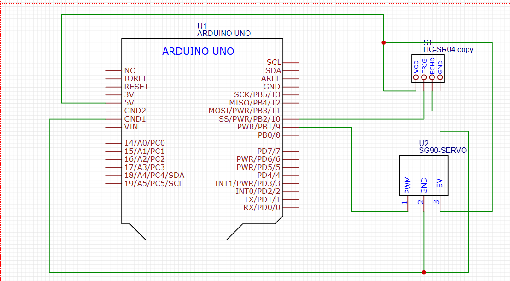

# Radar using Ultrasonic Sensor and Arduino with Processing Software

Radar (yang dalam bahasa Inggris merupakan singkatan dari radio detection and ranging, yang berarti deteksi dan penjarakan radio) adalah suatu sistem gelombang elektromagnetik yang berguna untuk mendeteksi, mengukur jarak dan membuat map benda-benda seperti pesawat terbang, berbagai kendaraan bermotor dan informasi cuaca (hujan).

Namun pada projek kali ini, kita akan menggunakan sensor Ultrasonic sebagai input dari alat kita. Dan kemudian kita akan menampilkan hasil tangkapan sensor tersebut di laptop dengan bantuan Processing Software

## Dasar Teori
Lihat page berikut jika ingin melihat [Dasar Teori](DASAR-TEORI.md)

## Langkah Kerja

## Wiring

## Hasil 

## Kesimpulan
Keren
### Permasalahan saat menduplikasi
1. Kurang idealnya mounting Sensor ke servo
2. Pemasangan Servo ke breadboard juga kurang kokoh
3. Masih bingung menggunakan Processing Software
4. Pada saat di Processing Software, aku harus mengubah/menyamakan COM/port yang digunakan arduino beserta serial nya
5. Mengubah resolusi Radar
6. Harus mendownload font dulu ke folder yang sama dan memuatnya sesuai dengan namanya
### Kekurangan
1. Kekuatan alat
2. Kerapian alat
3. Kemampuan dalam menerima input dan menampilkanya belum jauh (sekitar 30cm saja)
### Future Idea
1. Adding Buzzer and LED for alarm, dengan memberikan pola-pola tertentu sesuai dengan jarak, degree, dll.
2. Membuat radar agar bisa mengikuti suatu objek ketika sudah terdeteksi (Locking system)
3. Membuat layaknya gun/senjata yang akan ikut mengarahkan moncongnya ke target

[SOURCE](https://howtomechatronics.com/projects/arduino-radar-project/)
