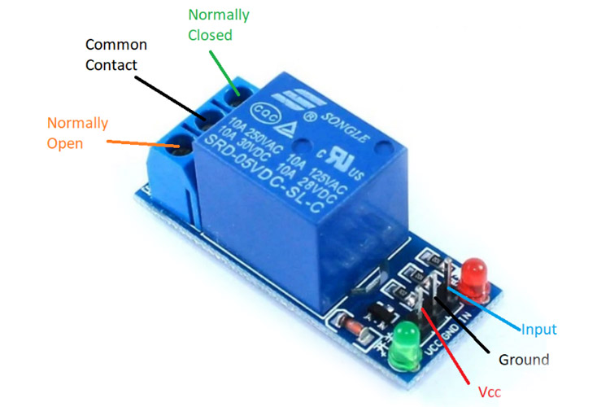
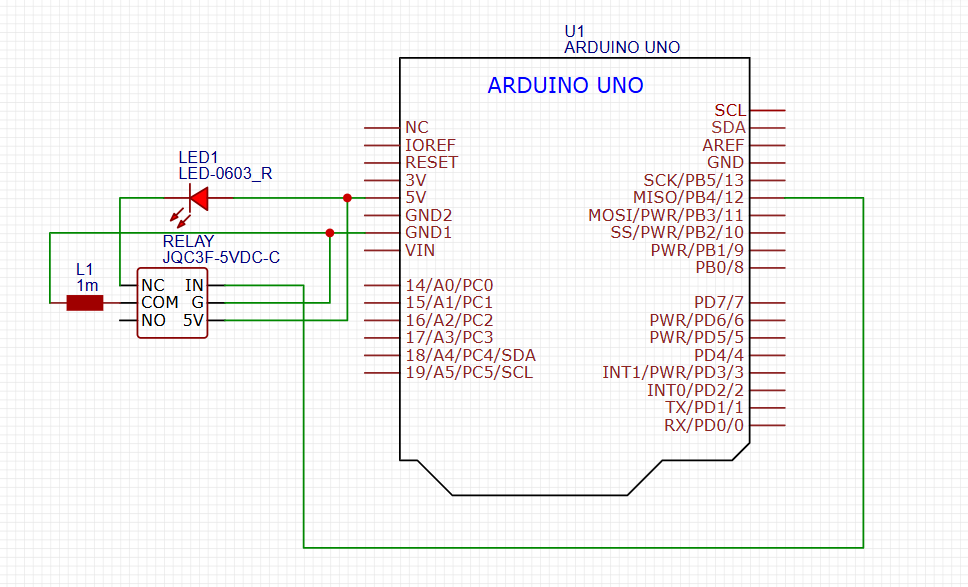
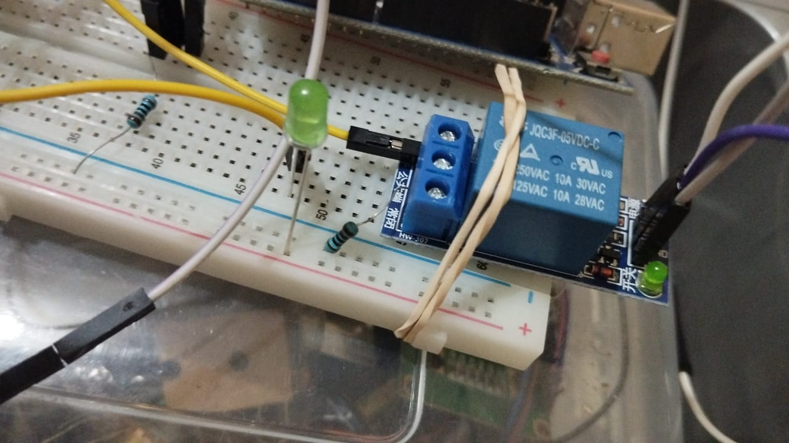

this is a markdown
# Playing with Relay: Learn Basic and Practice It
<a href="https://www.arduinoindonesia.id/2024/02/mengenal-modul-relay-arduino-cara-kerja-dan-aplikasi-praktis.html" target="_blank" rel="noopener noreferrer">
Source
</a>

## Definisi
Modul relay Arduino adalah perangkat keras yang memungkinkan kontrol perangkat listrik eksternal seperti lampu, motor, dan peralatan rumah tangga melalui platform Arduino. Modul ini terdiri dari sebuah relay dan komponen pendukung lainnya yang terintegrasi dalam papan sirkuit cetak (PCB). Relay sendiri berfungsi sebagai saklar elektronik yang dapat dikendalikan secara elektrik; ketika menerima sinyal listrik, kontaknya akan terbuka atau tertutup, memungkinkan atau memutus aliran arus listrik. Biasanya, modul relay ini terhubung ke papan Arduino melalui pin digital.

## Cara Kerja
Prinsip kerja modul relay Arduino melibatkan pengendalian relay melalui sinyal dari Arduino. Ketika pin kontrol relay menerima sinyal HIGH dari Arduino, koil di dalam relay teraktivasi, menyebabkan kontak relay beralih ke posisi tertutup dan memungkinkan arus listrik mengalir melalui koneksi output relay. Sebaliknya, saat pin kontrol menerima sinyal LOW, koil relay dinonaktifkan, dan kontak kembali ke posisi terbuka, memutus aliran arus listri
## Contoh Penggunaan
- Sistem Otomatisasi Rumah: Mengontrol lampu, kipas, atau peralatan rumah tangga lainnya secara otomatis, misalnya menyalakan lampu saat sensor cahaya mendeteksi kegelapan.
- Sistem Pengairan Otomatis: Mengendalikan pompa air untuk menyirami taman atau kebun secara otomatis berdasarkan jadwal atau kondisi kelembaban tanah.
- Proyek Internet of Things (IoT): Mengontrol perangkat elektronik dari jarak jauh melalui internet, memungkinkan pengendalian peralatan rumah tangga menggunakan perangkat pintar atau komputer.
- Sistem Keamanan Rumah: Mengaktifkan atau menonaktifkan sistem keamanan seperti alarm atau kamera CCTV.

### Contoh Proyek dengan Modul Relay Arduino
- Lampu Pintar: Sistem pencahayaan yang dapat diatur secara otomatis atau dikendalikan dari jarak jauh melalui perangkat pintar.

- Kontrol Pintu Otomatis: Pintu yang dapat membuka atau menutup secara otomatis berdasarkan sinyal dari perangkat pintar atau sensor gerak.

- Sistem Kebun Vertikal: Pengairan otomatis untuk kebun menggunakan sensor kelembaban tanah dan modul relay Arduino.

- Stasiun Cuaca Pintar: Perangkat yang memberikan informasi tentang suhu dan kelembaban serta dapat mengontrol sistem pendingin atau pemanas rumah.

## Alat dan Bahan Projek Kali Ini
1. Relay Single Channel (JQC3f-5VDC-C)
2. Resistor
3. LED
4. Microcontroller (Arduino Uno)
5. Kabel Jumper
6. Obeng

## Wiring

## Hasil
### Maaf yah kalau belum ada video ketika dihidupin

## Kesimpulan
1. Aku belajar sedikit2 tentang relay, cara kerja, tipe2
2. Aku baru tahu kalau #define RELAY 22 nantinya akan membaca RELAY dengan 22 ketika dijalankan, dan dengan ini kita bisa layaknya mendeklarasi variabel tertentu untuk menyimpan nilai pin 
3. Tau cara pemasangan/wiring Relay Single Channel
## Permasalahan saat Menduplikasi
1. Indikator lampu relay rusak, sehingga tidak bisa melihat perubahan secara langsung/cara kerjanya
## Kekurangan
1. Terlalu simpel, aku belum terlalu belajar mengenai penerapannya secara langsung
## Future Idea
1. Mengatur lampu
2. Mengatur Aktuator tertentu dengan masukan suatu sensor
