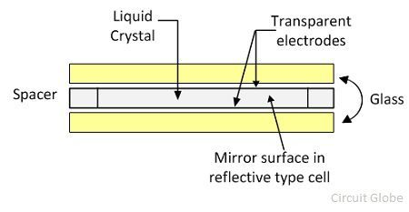
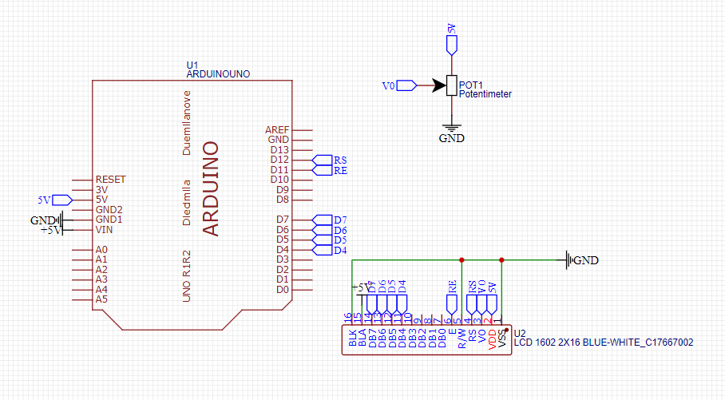

# Playing With LCD : Learn and Make a Menu Screen in it

## Apa itu LCD??
LCD (Liquid Crystal Display) adalah salah satu jenis media tampilan yang menggunakan kristal cair untuk menampilkan informasi dalam bentuk teks maupun grafis. LCD bekerja dengan cara mengatur orientasi kristal cair melalui medan listrik, sehingga dapat mengatur cahaya yang melewatinya.

LCD sangat umum digunakan dalam berbagai perangkat elektronik seperti smartphone, kalkulator, jam digital, televisi, hingga perangkat mikrokontroler seperti Arduino. Dibandingkan teknologi tampilan lainnya, LCD memiliki kelebihan berupa bentuk yang tipis, hemat energi, dan mampu menghasilkan tampilan teks yang jelas dan tajam.

### LCD Character Display
LCD karakter (seperti 16x2 atau 20x4) adalah jenis LCD yang menampilkan karakter alfanumerik pada baris dan kolom tertentu. Modul ini biasanya menggunakan driver HD44780 yang kompatibel dengan banyak mikrokontroler, termasuk Arduino.

## Contoh Penggunaan
LCD karakter dapat digunakan untuk berbagai keperluan seperti:
- Menampilkan data sensor (misalnya suhu, kelembaban, jarak)
- Menampilkan status sistem (ON/OFF, aktif/nonaktif)
- Membuat tampilan menu interaktif untuk sistem kendali berbasis tombol
- Jam digital sederhana
- Interface sederhana pada proyek mikrokontroler

### Contoh Proyek Arduino
Proyek ini terdiri dari dua tahap:
1. **Tahap Dasar:** Menampilkan teks statis di layar LCD (seperti “Hello World” atau nama sensor).
2. **Tahap Lanjutan:** Membuat sistem menu (mirip seperti scrollview) menggunakan tombol navigasi, di mana pengguna dapat memilih menu yang berbeda dan menampilkan nilai/opsi berbeda berdasarkan input.

## Alat dan Bahan Projek Kali Ini
- 1x Arduino Uno / Nano / sejenisnya
- 1x LCD 16x2 (dengan atau tanpa modul I2C)
- 1x Potensiometer (10k Ohm) - jika tanpa modul I2C
- Kabel jumper secukupnya
- Breadboard
- Tombol tekan (push button) minimal 3 buah (untuk sistem menu)
- Resistor (10k atau 220 ohm untuk tombol, jika perlu)
- Power supply USB / dari adaptor

## Wiring
### Wiring pertama

Pada tahap pertama, LCD hanya digunakan untuk menampilkan pesan statis sederhana. Jika menggunakan **I2C**, koneksi hanya memerlukan 4 kabel: VCC, GND, SDA, dan SCL.

Jika tidak menggunakan I2C:
- RS → pin Arduino (misal D12)
- E  → pin Arduino (misal D11)
- D4~D7 → pin Arduino (D5–D2)
- Potensiometer dihubungkan ke pin VO untuk mengatur kontras

### Wiring kedua
Untuk tahap menu scroll:
- Tambahkan tombol tekan ke pin digital Arduino, misalnya:
  - Tombol “atas” → D8
  - Tombol “bawah” → D9
  - Tombol “select” → D10
- LCD tetap terhubung seperti sebelumnya
- Tombol-tombol digunakan untuk menavigasi dan memilih menu

## Hasil
### Hasil pertama
LCD berhasil menampilkan teks seperti "Hello World" atau "Suhu: 25°C" sesuai yang diketik dalam kode. Ini memperkenalkan dasar penggunaan perintah `lcd.setCursor()` dan `lcd.print()`.

### Hasil kedua
Dengan tombol navigasi, sistem dapat berpindah antar item menu, seperti:

Tampilan menu berpindah sesuai tombol ditekan, dan dapat masuk ke sub-menu atau aksi spesifik.

## Kesimpulan
### Permasalahan
- Kadang LCD tidak menampilkan tulisan karena kontras belum diatur (terutama tanpa I2C)
- Saat membuat sistem menu, perlu logika navigasi yang jelas agar tidak membingungkan pengguna
- Tombol bisa mengalami bouncing, sehingga perlu teknik **debounce**

### Kekurangan
- LCD karakter terbatas hanya pada teks, tidak bisa menampilkan grafis
- Resolusi rendah, sehingga tampilan kurang fleksibel
- Menu yang panjang butuh implementasi scroll yang rapi

### Future Ideas
- Menggabungkan sensor (misalnya sensor suhu, kelembaban) ke dalam sistem menu
- Menambahkan **EEPROM** untuk menyimpan pengaturan menu
- Mengembangkan sistem menu multi-layer dengan sub-menu
- Menggunakan rotary encoder sebagai pengganti tombol
- Upgrade ke **OLED** atau **TFT display** untuk tampilan lebih interaktif
- Menggabungkan dengan modul RTC (real time clock) untuk aplikasi seperti jam digital menu-based

---

**Referensi:**
- https://docs.arduino.cc/learn/electronics/lcd-displays/  
- https://lastminuteengineers.com/arduino-1602-character-lcd-tutorial/  
- https://howtomechatronics.com/tutorials/arduino/lcd-tutorial/  
- Proyek Menu System: https://www.youtube.com/watch?v=Q58mQFwWv7c
