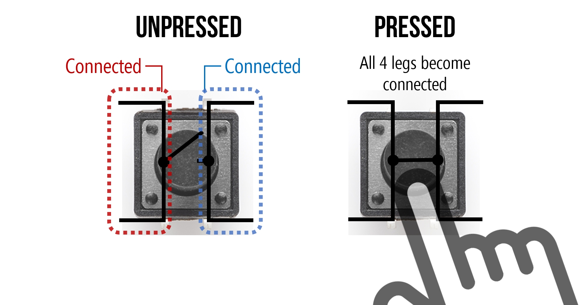
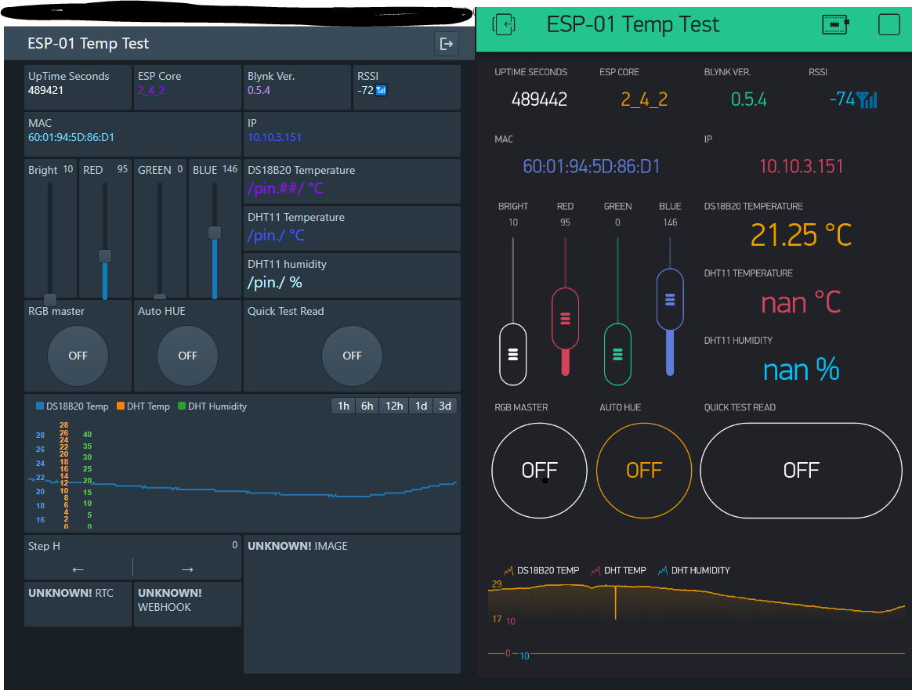
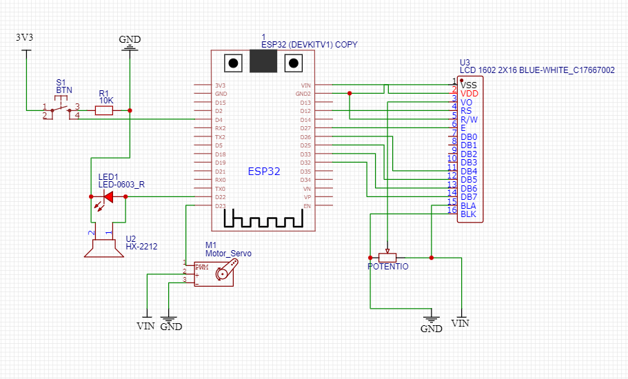
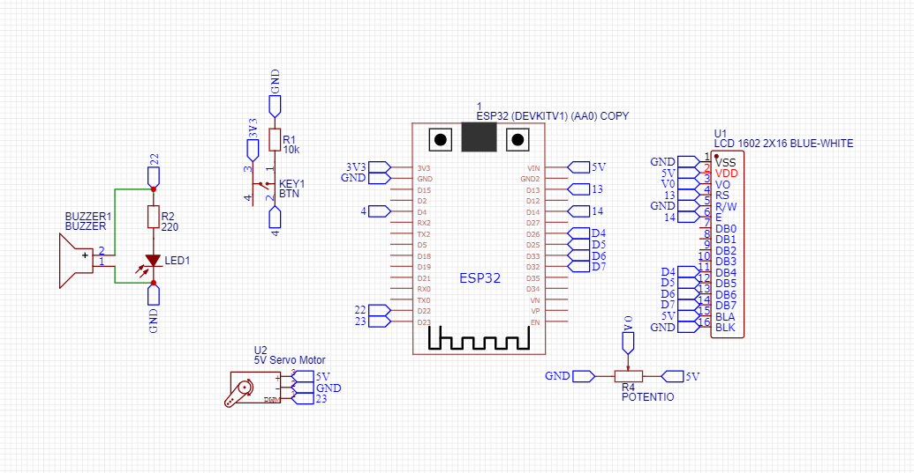

# Cat Feeder with ESP
---
In this project, i will create a device for feeding pet automaticly with ESP. First, i will make only with servo and some button (MVP 1). Next, maybe i will use RTC sensor (Real Time Clock) so the device can activated using timer or at certain times. And lastly, i will integrating it with IoT so the device can be controlled remotely and more flexible

---
## Dasar Teori
 Pemberian makan kepada hewan peliharaan sering kali membuat pemiliknya lupa untuk melakukannya. Di tengah-tengah kesibukan pemiliknya, diperlukan suatu solusi simpel yang bisa membantu memberikan makanan secara otomatis atau secara remote/ jarak jauh. Maka dari itu, diperlukanlah alat pemberi makan otomatis dengan menggunakan ESP dan diintegrasikan dengan IoT. 

 Pada taham pertama, kami akan membuat alat yang sangat sederhana yaitu dengan hanya mengaktifkan alat feeder dengan menggunakan button. Tahap kedua,setelah menunggu sensor RTC datang, alat akan menggunakan sensor tersebut agar bisa digunakan secara otomatis dan bisa diset jadwal untuk pemberian makan. 
 
 Tahapan terakhir adalah kami akan memanfaatkan kemampuan komuniaksi ESP dengan mengintegrasikan alat tersebut denagn aplikasi cloud berupa Blynk sehingga alat tersebut bisa digunakan secara remote atau jarak jauh dan bisa menyelesaikan permasalahan awal

 **Note:**
 Tapi karena aku di rumah gapunya peliharaan, maybe aku akan membuat alat ini berfungsi di luar ruangan (outdoor). Maka dari itu maybe aku perlu membuat alat tersebut berfungsi atau tahan ketika ditaruh di luar ruangan
### Apa itu Cat Feeder
Cat Feeder adalah alat otomatis yang dirancang untuk memberi makan hewan peliharaan, khususnya kucing, pada waktu tertentu dan dalam jumlah yang terkontrol. Alat ini bermanfaat bagi pemilik hewan yang sering bepergian atau memiliki jadwal padat.
### Apa itu ESP
ESP (seperti ESP8266 atau ESP32) adalah mikrokontroler dengan kemampuan WiFi bawaan yang memungkinkan alat untuk terhubung ke internet. ESP cocok digunakan dalam proyek IoT karena fleksibilitas dan kemampuannya untuk dikendalikan dari jarak jauh melalui jaringan.
### Apa itu PushButton
Push button ya... saklar. Saklar intinya adalah alat yang digunakan untuk memutus rangkaian listrik agar arus tidak mengalir pada rangkaian tersebut. Switch akan memutus rangkaian ketika kita menonaktifkan atau membuat state dari switch tersebut menjadi nonaktif

Pushbutton, yang bekerja mirip seperti switch, hanya aktif ketika ditekan saja dan akan berubah state ketika tidak dipencet kembali

 

button yang akan kita gunakan adalah jenis tactile button / four leg button. Jadi nantin terdapat 4 terminal yang berguna sebagai button, terdapat 2 pasang saklar yang sudah terhubung/terpasang langsung dan ada yang harus diaktifkan dulu button nya sebelum terhubung

**Terminal yang terdekatnya itu saling tidak terhubung, sedangkan terminal yang lebih jauh tapi tetap satu sisi itu saling terhubung**

### Apa itu RTC Sensor

RTC (Real Time Clock) adalah modul yang menyimpan waktu aktual (jam dan tanggal) meskipun mikrokontroler dimatikan. Dengan RTC, mikrokontroler dapat menjalankan suatu perintah pada waktu tertentu, misalnya memberi makan kucing setiap jam 7 pagi dan 5 sore.
### Apa itu Blynk

Blynk adalah platform IoT yang memungkinkan pengguna membuat antarmuka mobile untuk mengontrol mikrokontroler seperti ESP melalui aplikasi. Dengan Blynk, pengguna bisa memberi perintah kepada alat dari smartphone.

### Cara Kerja Blynk

### Cara Kerja
- **MVP 1** : Aku mau ketika **tombol pushbutton ditekan, servo sebagai penutup food container akan bergerak** dan nantinya LED&Buzzer akan aktif juga. LCD bisa menampilkan status dari pengaktifan feeder tersebut ataupun juga bisa untuk memberi tahu sisa makanan yang tersedia (berarti memerlukan suatu sensor pengukur seperti ultrasonik) 
  Atau, sistem kedua, **pushbutton ketika dipencet akan mengaktifkan servo selama beberapa waktu** (agar mengeluarkan makanan dengan sejumlah takaran tertentu). Dan nanti bisa aja ada pushbutton lain yang bisa digunakan untuk mengatur seberapa lama servo akan dibuka yang akan berhubungan dengan seberapa banyak takaran per pengaktifan
- **Tahap 2** : RTC mengatur jadwal makan otomatis. Servo akan bergerak pada waktu tertentu.

- **Tahap 3** : Blynk atau platform IoT lainnya digunakan untuk memberi makan secara remote dari HP
## Alat dan Bahan
- 1x ESP8266 (NodeMCU) atau ESP32
- ESP32 Expansion board
- 1x Servo motor (SG90)
- 1x Push Button
- 1x RTC Module (DS3231 atau DS1307)
- Kabel jumper secukupnya
- Breadboard
- Catu daya (power bank atau adaptor 5V)
- Wadah untuk tempat pakan
- Botol Mineral
- Hot glue/perekat (untuk rakitan mekanis)
## Langkah Kerja
### MVP 1 (Button Controlled Feeder)
. Susun dulu rangkaian pushbutton
1. Rangkai servo ESP di breadboard.
2. Tulis program sederhana untuk memutar servo ketika tombol ditekan.
3. Upload kode ke ESP menggunakan Arduino IDE.
4. Uji coba: tekan tombol → servo bergerak → pakan keluar.
5. Atur posisi servo agar dapat membuka dan menutup wadah pakan secara efisien.
6. Lalu pasang LCD sebagai tampilan status dan info lainnya
### MVP 2 (RTC controlled)
1. Pasang modul RTC ke ESP.
2. Sinkronkan waktu RTC dengan waktu aktual.
3. Program ESP agar membaca waktu dari RTC dan menjalankan servo di waktu tertentu (misalnya jam 7 pagi dan 5 sore).
4. Uji coba: amati apakah servo bergerak sesuai jadwal.
### MVP 3 (Integrate it with IoT)
1. Hubungkan ESP ke WiFi.
2. Gunakan aplikasi Blynk (atau IoT lain) untuk membuat tombol kendali jarak jauh.
3. Tambahkan fungsi di ESP agar bisa menerima perintah dari aplikasi dan menggerakkan servo.

## Wiring
### Wiring Pertama

### Wiring Kedua
### Wiring Ketiga
## Code
### Code Pertama

### Code Kedua
### Code Ketiga
## Hasil

## Kesimpulan
### Permasalahan 
1. Tiba-tiba terjadi korsleting saat troubleshoot kenapa LCD ga munculin teks
2. Input dari Blynk kurang konsisten, menyebabkan makanan yang keluar ga sesuai keinginan kita.
3. Jika kita mau menjadikannya IoT. Pastikan tombol atau input dari IoT itu hanya **untuk menjalankan perintah secara jelas**, jangan untuk mengaktifkan atau mematikan sesuatu secara langsung.
### Kekurangan
#### Kekurangan Alat Pertama
#### Kekurangan Alat Kedua
#### Kekurangan Alat Ketiga
### Future Ideas

---
## Source
[Physical Computing : Buttons](https://makeabilitylab.github.io/physcomp/arduino/buttons.html)
[circuitdigest : pet feeder using arduino](https://circuitdigest.com/microcontroller-projects/automatic-pet-feeder-using-arduino)
[Instructable : How to Make an Easy Automatic Pet Feeder for Less Than $25!](https://www.instructables.com/Simple-and-Easy-Automatic-Pet-Feeder-With-Arduino/)
[Instructable : Automatic Arduino Powered Pet Feeder](https://www.instructables.com/Automatic-Arduino-Powered-Pet-Feeder/)
[RandomNerdTutorial : LCD](https://randomnerdtutorials.com/esp32-esp8266-i2c-lcd-arduino-ide/)