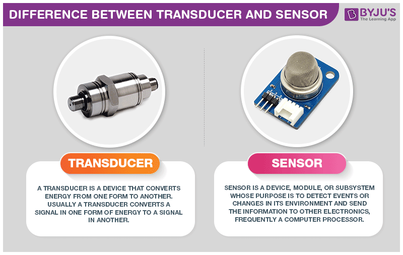
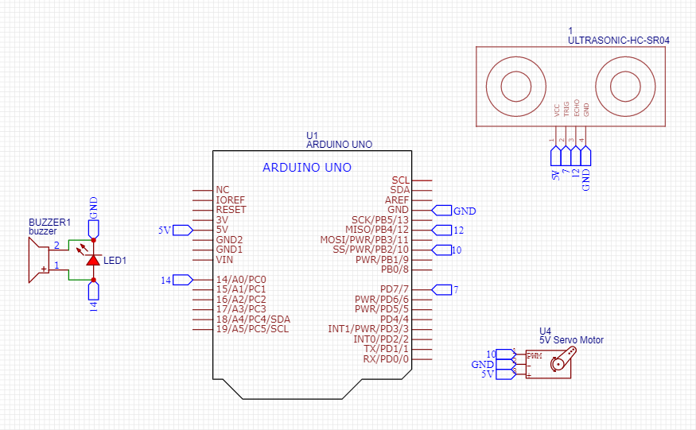
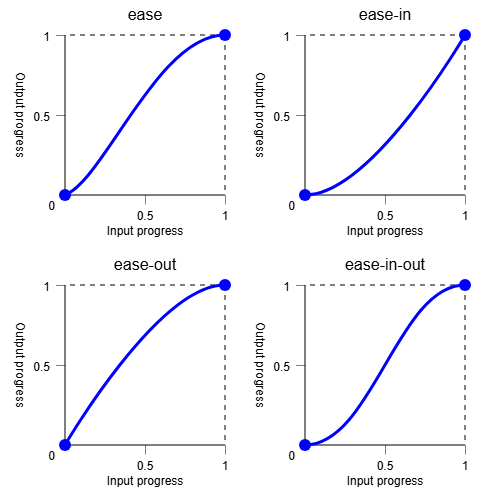
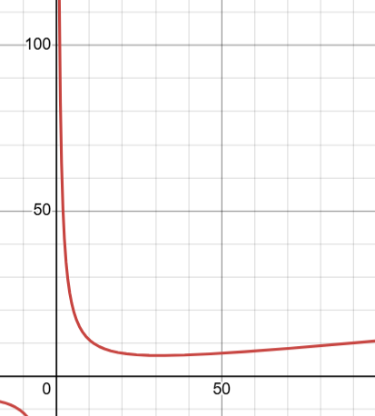

# Simple SmartTrash
---

In this project, i will only recreate a simple automatic trash bin project. I will use one ultrasonic sensor (HC SR04) and servo as actuator (trash lid opener). And i will made some modification on existing project/source project, that is i will make servo move smoother when first move and when move will end. and i will place HC SR04 sensor tilted upwards so sensor can collect response more precise.

---
## Dasar Teori
### Apa itu SmartTrash
SmartTrash adalah tempat sampah otomatis yang mampu mengenali keberadaan manusia atau objek di dekatnya menggunakan sensor, kemudian merespons dengan membuka tutupnya. Ini merupakan bagian dari implementasi IoT atau smart system yang membuat alat-alat di sekitar kita lebih responsif dan interaktif
### Apa itu Ultrasonic Sensor HC SR04

Sensor Ultrasonik sama sekali tidak perlu pin analog dalam menjalankan fungsionalistas nya meskipun sinyal yang dikeluarkan sensor adalah sinyal ultrasonik analog
. Hal ini karena sensor ultrasonic **HC SR04 itu sendiri merupakan sebuah modul lengkap** yang fungsinya tidak hanya sebagai transducer saja. Melainkan juga mengonversi sebuah sinyal menjadi bentuk yang berguna atau dapat diamati oleh suatu sistem dan bisa digunakan

> Hal ini membuat saya sedikit tercerahkan, karena sampai sebelum saya membaca ini, yang aku pikirkan tentang sensor ya hanya fungsinya sebagai **Indera** komputer dalam berhubungan dengan dunia asli

### Apa itu Servo SG90
Servo SG90 merupakan motor servo kecil dengan sudut rotasi sekitar 180 derajat. Servo ini dikendalikan dengan sinyal PWM, yang artinya sudut posisi ditentukan oleh lebar pulsa dari Arduino. SG90 banyak digunakan pada projek robotik karena ukurannya kecil, ringan, dan cukup kuat untuk aplikasi ringan seperti penutup tempat sampah otomatis

## Cara Kerja
- Sensor ultrasonik HC SR04 mengirimkan sinyal ultrasonik dan akan menangkap sinyal pantulan
- Ketika terdapat benda di dekatnya (<10 cm), sensor akan mengirimkan data/sinyal sebagai tanda bahwa ada objek didepan
- Ketika arduino menerima sinyal input dari sensor, arduino memberikan output pada Servo untuk membuka dan memberikan sinyal HIGH ke LED dan Buzzer
- Servo akan membuka dengan delay tertentu dan ketika sudah terbuka, servo akan menahan keadaan tersebut sampai tidak ada objek yang berada didepan sensor
- Ketika sudah tidak ada, servo akan menutup secara perlahan dan LED&Buzzer akan mati
- Program akan berulang
## Alat dan Bahan
- Microcontroller (Arduino UNO R3)
- Sensor Ultrasonic HC SR04
- Servo Motor SG90
- Kabel Jumper
- Breadboard
- Kardus
- Solatip
- Lem
## Langkah Kerja
- Merancang wiring antara Arduino, sensor HC-SR04, dan Servo SG90.
- Menentukan pin yang digunakan untuk input dan output.
- Menulis dan meng-upload program ke Arduino.
- Melakukan pengujian untuk mendeteksi apakah sensor bekerja dengan benar.
- Mengatur logika kontrol servo berdasarkan pembacaan dari sensor.
- Menambahkan LED sebagai indikator bahwa objek terdeteksi.
- Mengatur delay dan logika gerakan servo agar lebih smooth.
- Melakukan eksperimen untuk menghindari noise dan false trigger pada sensor.
- Memasang seluruh sistem ke dalam bentuk fisik tempat sampah.
- Melakukan dokumentasi hasil dan pergerakan.

## Wiring
### Wiring Pertama

## Code
[Go To Code]()
## Hasil
Hasilnya terdapat pada gambar berikut:

[Go To Video Result](./SmartTrash-result.mp4)

Pada projek kali ini juga, saya juga memberikan modifikasi sedikit dibagian **Kesan kemewahan dan elegan** bagi pengguna. Caranya adalah dengan **menggerakkan Relay secara perlahan ketika membuka maupun ketika menutup**.

Cara membuat relay bisa bergerak secara perlahan adalah konsepnya sama seperti konsep **PID** agar membuat gerakan atau kondisi tidak berubah secara tiba-tiba

Prinsip yang dipakai adalah ***Ease in and Ease out***:

Artinya saya mencoba membuat bahwa gerakan si servo akan bergerak secara perlahan pada saat awal pergerakan dan akan bergerak lebih cepat ditengah dan akan melambat lagi saat sudah selesai.

Untuk mencapai hal tersebut, kita harus memberikan delay pada program servo sedemikian rupa sehingga pergerakan servo bisa melambat pada saat-saat tertentu.

formula delay yang saya gunakan untuk servo pada saat gerakan membuka adalah:

    delay((100/i)+i/10);

> Dengan sumbu x merupakan sudut servo (kondisi servo) dan y adalah delay
Semakin tinggi delay, semakin lambat gerakannya
## Kesimpulan
Dari proyek dan implementasi kode di atas, dapat disimpulkan:
- Sensor HC-SR04 berhasil digunakan untuk mendeteksi jarak dengan **akurat dalam rentang 2–400 cm**.
- Servo berhasil **dikendalikan dengan sinyal PWM** melalui library Servo.h, dan dapat bergerak secara dinamis berdasarkan jarak yang terdeteksi.
- Implementasi logika opened dan delay dinamis berhasil menciptakan sistem otomatisasi satu arah: membuka saat objek mendekat dan menutup saat objek menjauh.
- Penambahan delay dengan formula (100/i)+i/10 terbukti efektif dalam **memberikan transisi gerakan servo yang lebih alami** (ease in–ease out).
- Proyek ini **dapat dikembangkan lebih** lanjut dengan sistem pengendalian ganda, sensor tambahan, atau aktuator pendukung seperti buzzer, OLED, atau LED RGB sebagai indikator sistem.
### Permasalahan
1. Timer1 Conflict ketika kita menyoba memakai pin 9 dan 10 dengan fungsi yang berbeda (9 untuk Ultrasonik, 10 untuk PWM Servo)
2. **PulseIn()** Sangan sensitif dengan noise (dalam hal timing) sehingga bisa mempersulit dalam penggunaan yang persisi
   > Bukti bahwa *PulseIn* sangat sensitif adalah dengan memberikan delay pada led sebagai tanda ketika terdapat objek didepan ultrasonik
   
   Solusinya adalah dengan mengurangi noise nya dengan beberapa cara, yaitu secara kode, ataupun dengan filter kapasitor.

   Caraku adalah dengan memberikan filter
    
        if (distance > 2 && distance < 400) {
        if (distance < 10) {
        // perintah servo
        }
        }

3. **Servo kurang bisa tertutup/terbuka rapat** karena masalah penutup (mekanik) sehingga menyebabkan kode tertahan dan akhirnya menjadikan program kurang responsif.
### Kekurangan
- Sistem masih sangat tergantung pada posisi dan ketinggian objek (kadang tidak terdeteksi jika benda kecil atau tidak reflektif).

- Tidak ada fitur keamanan (contoh: jika tangan pengguna terlalu lama di dalam, servo tetap menutup).

- Power supply servo bisa drop jika hanya mengandalkan 5V pin dari Arduino (tidak stabil kalau banyak beban).
- Casing atau Mekanik sampahnya masih dalam bentuk prototipe (dari kardus) sehingga kurang menarik dan kurang berkualitas
### Future Ideas
> Pelajari hubungan pin2 dengan Timer, hal yang menyebabkan permasalahan pada projek kali ini

- Menambahkan sensor inframerah untuk akurasi tambahan.
- Membuat sistem logging sampah: misalnya, berapa kali dibuka, atau sudah penuh/belum. (**IoT baybehhh**)

- Menggunakan proximity sensor berbasis inframerah untuk melengkapi ultrasonic.

## Source
[How to Mechatronics : How servo motor work](https://howtomechatronics.com/how-it-works/how-servo-motors-work-how-to-control-servos-using-arduino/)
[How to Mechatronics : Ultrasonic Sensor HC SR04](https://howtomechatronics.com/tutorials/arduino/ultrasonic-sensor-hc-sr04/)
[Wokwi : Servo Code](https://wokwi.com/projects/374644935912458241)
[Arduino ProjectHub : Arduino Trash Bot](https://projecthub.arduino.cc/ashraf_minhaj/arduino-trash-bot-auto-openclose-trash-bin-c81eff)