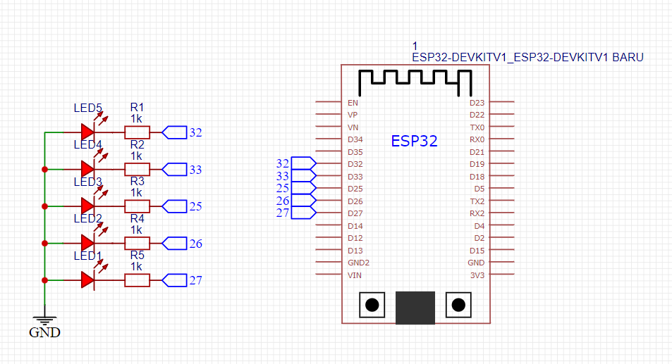

# Still Under Progress
# Hand Gesture With ESP32 and PlatfromIO 🐜

## Dasar Teori

### Apa itu PlatfromIO

PlatfromIO adalah IDE atau Extension IDE yang sangat berguna bagi pengembangan sistem benam (IoT) seperti Arduino,ESP, dll.

Keunggulan menggunakan PlatfromIO dibandingkan Arduino IDE adalah **kebebasan kita dalam mengatur projek** sehingga projek lebih profesional. Dengan menggunakan IDE PlatfromIO, kita bisa **memanfaatkan fitur-fitur yang ada di VSCode** (Syntax Highlighting, Intellisense, Debugging, Versio`nControl, File Management) yang tidak ada di Arduino IDE. Selain itu, kita juga bisa mengatur libarary/dependency yang digunakan di projek kita dengan lebih bebas dan lebih terstruktur, sehingga membuat projek kita lebih scalable.

### Apa itu MediaPipe
### Apa itu OpenCV
### Cara Kerja

## Alat dan Bahan

## Langkah Kerja

## Wiring

### Wiring Pertama

## Code

## Hasil

## Kesimpulan

### Permasalahan

### Kekurangan

### Future Ideas
