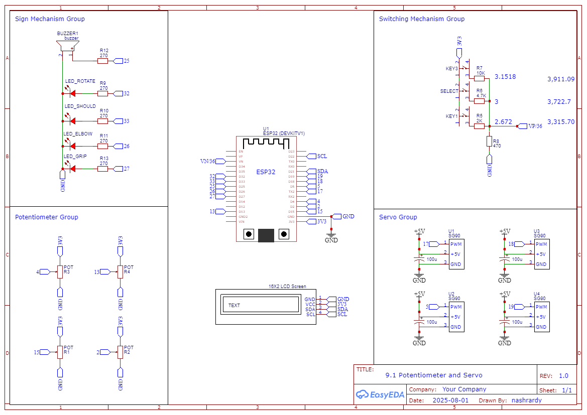

# Robotic Arm Cardboard with 4 Mode Control

Proyek ini adalah pengembangan lengan robot sederhana yang terbuat dari kardus, terinspirasi dari proyek "Recordable Cardboard Robot Arm". Lengan robot ini dirancang untuk dioperasikan dengan empat mode kontrol berbeda, yang memungkinkan pengguna untuk berinteraksi dengan robot secara manual, merekam dan memutar ulang gerakan, atau mengendalikannya dari jarak jauh melalui Wi-Fi.untuk navigasi.

## Dasar Teori

Proyek ini menerapkan konsep kontrol sistem tertanam (embedded system) di mana perangkat keras (hardware) dan perangkat lunak (software) bekerja sama untuk menjalankan fungsi spesifik. Mikrokontroler ESP32 membaca input dari tombol analog, memprosesnya sesuai dengan logika yang telah ditentukan, dan menampilkan status sistem pada display LCD.

- ESP32: Mikrokontroler dengan Wi-Fi dan Bluetooth terintegrasi, yang cocok untuk proyek IoT (Internet of Things) dan kontrol robot.

- Tombol Analog: Menggunakan pembacaan analog untuk mendeteksi beberapa penekanan tombol dari satu pin, memanfaatkan pembagi tegangan (voltage divider) dengan beberapa resistor.

- Display LCD I2C: Menampilkan informasi menu dan status mode secara real-time, memungkinkan pengguna berinteraksi tanpa memerlukan komputer.

- Modular Programming: Kode dibagi menjadi beberapa file terpisah (.h dan .cpp) untuk setiap fungsionalitas (misalnya, tombol, LCD, pin), yang memudahkan pengembangan, pembacaan, dan pemeliharaan kode.

### Cara Kerja

Proyek ini bekerja berdasarkan interaksi antara pengguna, sensor, dan aktuator, yang semuanya diatur oleh mikrokontroler ESP32:

1. **Input Pengguna:** Pengguna berinteraksi dengan sistem melalui tombol analog. Nilai analog dari tombol ini dibaca oleh ESP32 untuk mendeteksi penekanan tombol mana yang dilakukan (kiri, kanan, atau pilih).
2. **Pemrosesan Logika:** Berdasarkan input tombol, ESP32 menjalankan logika yang relevan. Jika tombol ditekan, sistem akan beralih mode (Manual, Auto, Wi-Fi) atau melakukan navigasi dalam menu yang ditampilkan pada LCD.
3. **Tampilan Status:** Display LCD I2C berfungsi sebagai antarmuka visual, menunjukkan mode aktif saat ini, pilihan menu, dan pesan status lainnya, sehingga pengguna selalu tahu apa yang sedang terjadi.
4. **Aksi Aktuator:** Tergantung pada mode yang dipilih, ESP32 akan mengirimkan sinyal PWM ke motor servo.
5. **Mode Manual:** Sinyal PWM akan disesuaikan secara real-time berdasarkan input tombol untuk menggerakkan servo.
6. **Mode Auto:** ESP32 akan membaca data posisi servo yang telah direkam (saat mode record) dan mengirimkan sinyal PWM yang sesuai untuk mereplikasi gerakan tersebut (saat mode playback).
7. **Mode Wi-Fi:** Sinyal PWM dikendalikan oleh perintah yang diterima dari perangkat lain melalui koneksi Wi-Fi.

Dengan cara ini, proyek ini mengintegrasikan input, pemrosesan, dan output untuk menciptakan pengalaman kontrol yang komprehensif pada lengan robot.

## Alat dan Bahan

- ESP32

- Aktuator: Motor Servo SG90 4x

- Display LCD I2C
- Buzzer dan LED
- Tombol analog untuk navigasi menu
- Struktur: Kardus, kabel, dan bahan perakitan lainnya.
- Power supply yang stabil untuk ESP32 dan servo motor.

## Langkah Kerja

1. Konstruksi Mekanik: Membuat struktur lengan robot dari kardus sesuai desain yang diinginkan dan memasang motor servo pada sendi-sendinya.
2. Pengkabelan: Menyambungkan semua komponen elektronik, termasuk ESP32, LCD, tombol, dan servo.
3. Pengembangan Perangkat Lunak: Mengimplementasikan kode untuk setiap mode, memastikan transisi antar mode berjalan dengan lancar.
4. Kalibrasi dan Pengujian: Menyesuaikan nilai-nilai pembacaan tombol analog, sudut servo, dan menguji fungsionalitas perekaman dan playback gerakan.

## Wiring

## Code

## Hasil

## Kesimpulan

Proyek ini adalah platform pembelajaran yang efektif untuk memahami interaksi antara perangkat lunak dan perangkat keras dalam konteks robotika. Pendekatan modular yang digunakan dalam pengkodean mempermudah pengembangan dan penambahan fitur baru.

### Permasalahan

- Diperlukan kalibrasi yang cermat untuk pembacaan tombol analog dan rentang pergerakan servo untuk memastikan akurasi.
- Logika perekaman dan pemutaran ulang gerakan harus dioptimalkan untuk kelancaran dan presisi.

### Kekurangan

- Struktur kardus mungkin tidak cukup kuat untuk tugas berat dan perlu dipertimbangkan peningkatan bahan di masa depan.
- Memori ESP32 mungkin menjadi kendala jika data perekaman terlalu banyak.

### Future Ideas

1. Kontrol Tambahan: Menggunakan joystick atau potensiometer alih-alih tombol analog untuk kontrol manual yang lebih intuitif.
2. Penyimpanan Eksternal: Menambahkan modul SD card untuk menyimpan data gerakan dalam jumlah besar.
3. Kamera dan Visi Komputer: Menambahkan kamera untuk kemampuan dasar visi komputer, memungkinkan robot untuk mendeteksi objek.
4. Antarmuka Pengguna Wi-Fi yang Lebih Canggih: Membuat halaman web atau aplikasi yang lebih interaktif untuk kontrol jarak jauh.

---

## Source

[ProjectHub Arduino : Recordable Cardboard Robotic Arm](https://projecthub.arduino.cc/ryan6534/recordable-cardboard-robot-arm-4b6783)
