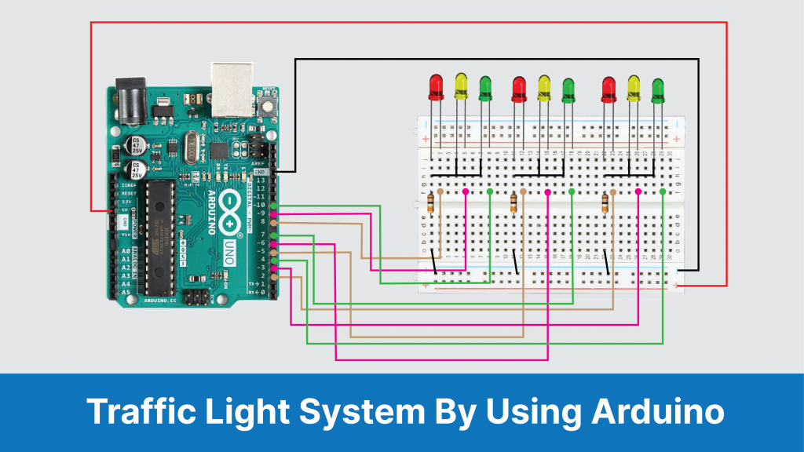
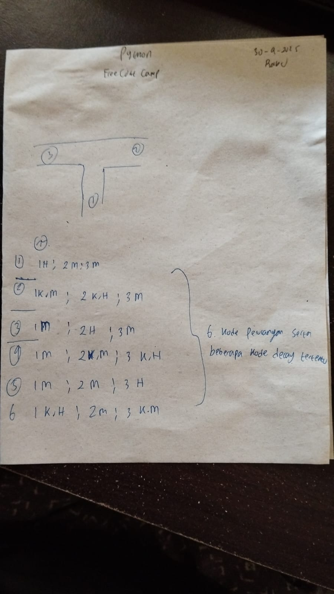

# Traffic Light Controller Using Arduino

The Arduino is the most popular open-source microcontroller board used for many electronics and DIY projects. Traffic light controller by using Arduino is a simple electronic project. Nowadays, everyone prefers a personal vehicle. Hence, the number of vehicles on the road is increasing continuously, which results in traffic jams.

Traffic light controller helps to manage the traffic and to maintain proper traffic management. These systems are placed at the intersections of the road or at the crossings to avoid congestions and accidents. The systems indicate to the driver by using different colours of light. Therefore it is simple to avoid congestion at the intersections.

This project is the traffic light controller by using Arduino. It is an electronic project by which we will get knowledge about traffic lights and how they work. This project is the simple version of a traffic light system where we have demonstrated it for three sides or ways.

## Need For Traffic Light System

Roads without any supervision or guidance can lead to traffic conflicts and accidents. Traffic signals are required for an orderly flow of traffic. A traffic signal is used as an instructing device that indicates the road user to act as per the displayed sign.

Traffic lights allow everyone to cross the intersection point one by one, reducing conflicts between vehicles entering intersection points from different directions. It provides road safety, also helps to solve traffic in simple manners.

There are different colours in traffic lights. Each light has a meaning, and these lights tell drivers what to do.

Red light ON- A driver should stop.
Yellow light ON- A driver has to slow down and be ready to stop.
Greenlight ON- A driver can start driving or keep driving.

## Component

	1. Arduino Uno
	2. Breadboard
	3. LEDs ( Red, Yellow, Green)
	4. Resistor( 220 Ohm)(*Aku pakai 1k ohm*)
	5. Dupont cables/ Jumper cables. (*Sekitar 10 *)
	
	
	
	
[source](https://robu.in/traffic-light-controller-using-arduino/)

## Circuit Connection (LED with Arduino)

## Cara Kerja
Cara kerja sederhananya adalah kita akan menyimulasikan jalan dengan 3 percabangan. Dan nantinya kita akan mengonfigurasikan kombinasi lampu-lampu yang ada sedemikian sehingga akan mengatur jalannya jalan agar mengatasi terjadinya kemacetan.
### Algoritma jalnnya lampu-lampu
	1. Terdapat 3 jalan 
	2. 

## Progres

1. Aku menduplikasi sedemikian rupa hingga hampir sama dengan kode awal
2.

## Conclusion

### The Problems and drawback

